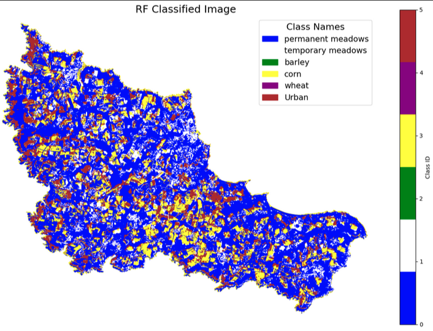
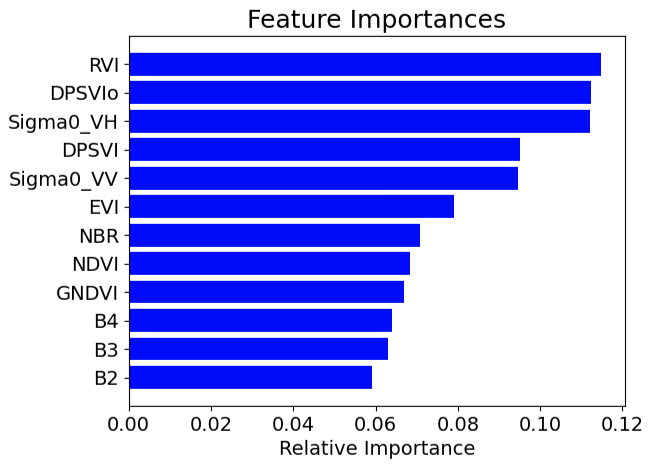

# Crop Classification of Belle-Île Island using Sentinel-1 and Sentinel-2 Data

In this project, I used vegetation indices derived from both Sentinel-1 and Sentinel-2 imagery for the crop classification of Belle-Île Island, France. This end-to-end project demonstrates the complete workflow, including data acquisition, preprocessing, feature engineering, and modeling.

## Key Features and Tools
- **Data Acquisition and Processing**: Leveraged the Google Earth Engine (GEE) Python API for querying and processing satellite imagery.
- **Feature Engineering**:  
  - **Sentinel-2 Vegetation Indices**: NDVI, GNDVI, NBR, and EVI.  
  - **Sentinel-1 Indices**: RVI, DPSVI, and DPSVIo.
- **Modeling**: Implemented crop classification using **Random Forest** and **XGBoost** machine learning algorithms.
- **Visualization**: Utilized **geemap** for interactive visualizations.

    

    

